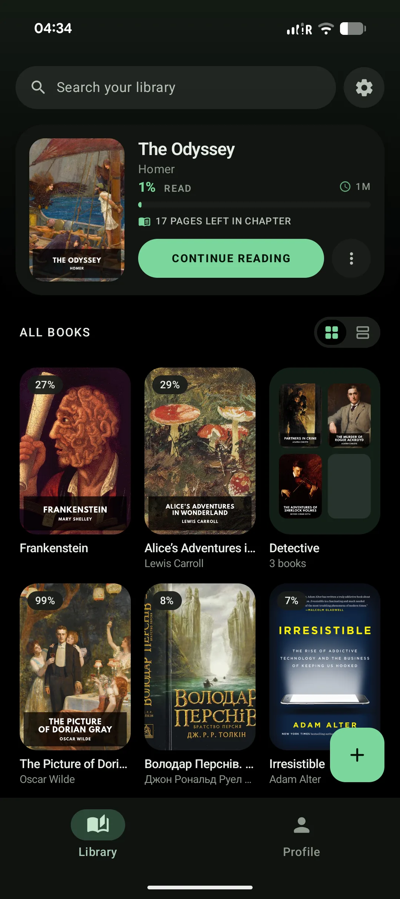
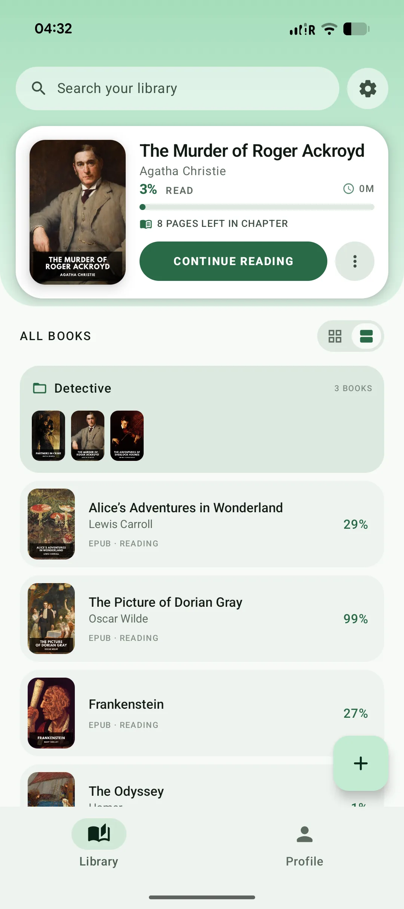
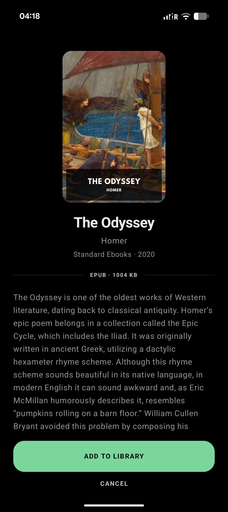
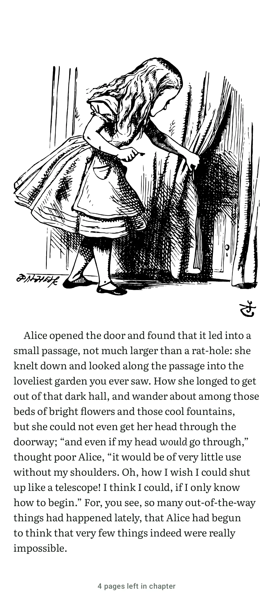
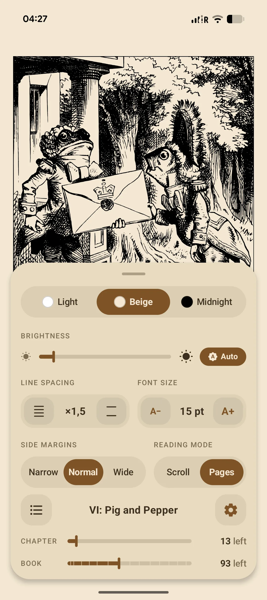
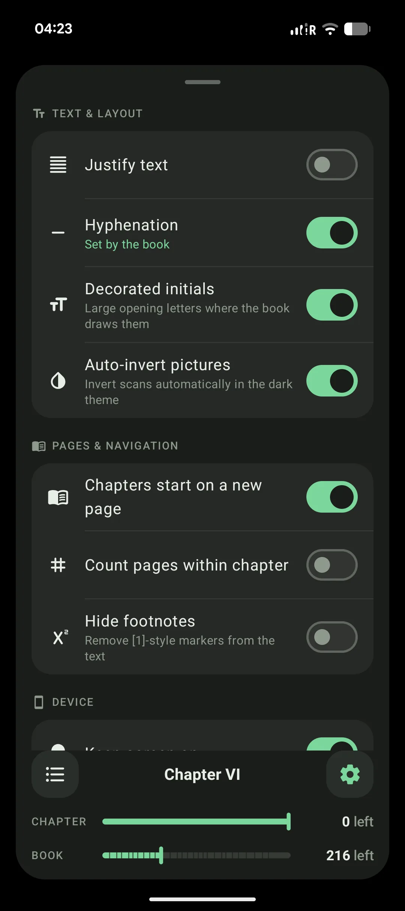
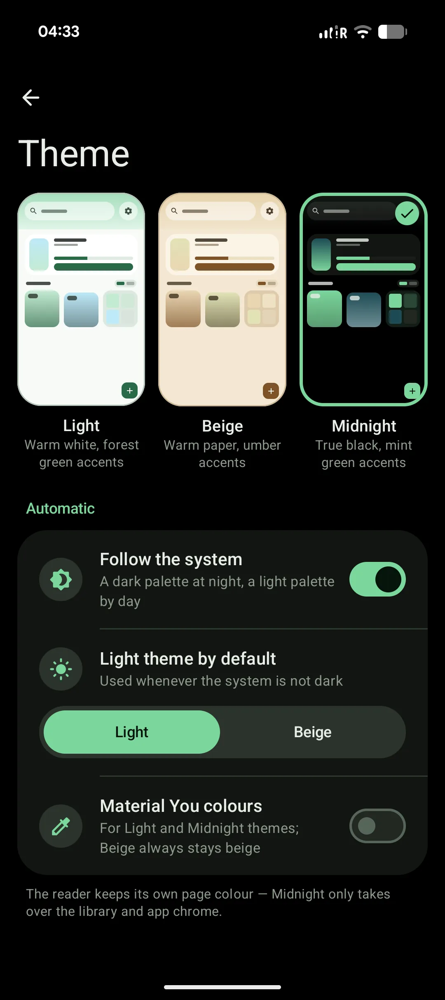
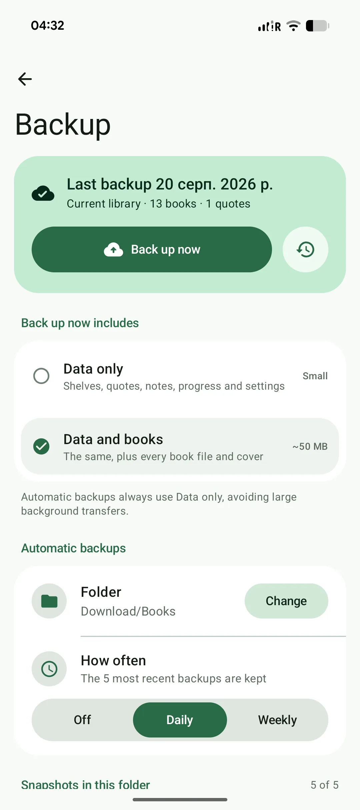

# FrogReader 🐸📖

[](https://kotlinlang.org/)
[](https://developer.android.com/)
[](https://developer.android.com/jetpack/compose)
[](https://github.com/KNITIPKA/frog-reader/releases/latest)
[](https://github.com/KNITIPKA/frog-reader/releases/latest)
[](LICENSE)

**FrogReader** is a free and open-source e-book reader for Android, built entirely with Kotlin and Jetpack Compose.

It supports **EPUB, FB2 and MOBI/KF8/PalmDoc**, with paged and continuous reading, shelves, full-text search, custom typography, publisher styling, local backups and more.

> [!WARNING]
> FrogReader is currently in **alpha**. Expect bugs, unfinished UI and breaking changes between versions. Builds are not published on Google Play yet.

### [Download the latest APK →](https://github.com/KNITIPKA/frog-reader/releases/latest)

Runs on **Android 8.0+ (minSdk 26)**.

---

## Screenshots

<p align="center">
  
  
  
</p>

<p align="center">
  
  
  
</p>

<p align="center">
  
  
</p>

---

## Features

### Reading

- **Paged and continuous modes** — read page-by-page or use continuous scrolling.
- **Reader themes** — Light, Beige and Midnight.
- **Typography controls** — font size, line spacing, margins, justification and hyphenation.
- **Custom fonts** — use the bundled fonts or import your own `.ttf` / `.otf` files.
- **Publisher Mode** — keep the book's original fonts, spacing and formatting when supported.
- **Hardware controls** — turn pages with the device volume buttons.
- **Footnotes** — open footnotes inline or hide footnote markers from the reading text.
- **Decorated initials** — render publisher-defined drop caps.
- **Right-to-left reading (preview)** — RTL-aware Arabic and Hebrew text, mixed-direction content, page progression and logical alignment; final physical-device validation is pending.
- **Dark-mode image inversion** — automatically invert bright scans and diagrams in dark themes.
- **Chapter and book progress** — see reading progress and pages remaining.

### Library

- **Grid and list views** — switch between a cover grid and compact list layout.
- **Shelves** — organize books into custom collections.
- **Multi-select** — add or remove multiple books at once.
- **Reading progress** — progress is shown directly in the library.
- **Live search** — search titles, authors, series and descriptions, including books inside shelves.
- **Book details** — view cover art, metadata, description, format and file size before adding a book.

### Search, Navigation & Notes

- **Full-text search** with live match previews.
- **Table of contents** navigation.
- **Smart return history** — return to the exact reading position after links, search, contents, bookmarks, progress scrubbing or a long continuous-scroll fling.
- **Text selection** inside the reader.
- **Quotes, bookmarks and notes** stored with your library.
- **Custom pagination engine** with cached page layouts for fast navigation.

### Themes & Android Integration

- **Light, Beige and Midnight app themes**.
- **Follow system theme** automatically.
- **Material You colors** for supported themes.
- **Optional app lock** using biometrics or device credentials on Android 10+.
- **Home-screen Continue Reading widget** powered by Jetpack Glance.

---

## Backup & Data Safety

FrogReader keeps its library local and gives you direct control over backups.

- **Export & Restore** — save the library as a `.zip` archive and restore it later.
- **Data-only backups** — save shelves, quotes, notes, progress and settings without copying large book files.
- **Full backups** — optionally include original book files and covers.
- **Scheduled backups** — run automatically every day or every week.
- **Snapshot rotation** — keep the five most recent automatic backups.
- **Storage Access Framework** — choose any folder exposed by Android's system file picker, including folders provided by Google Drive, Dropbox, OneDrive or Nextcloud.
- **Split storage** — book metadata, user-created data and reading positions are stored separately.
- **Crash-resistant writes** — data is staged through temporary files and backup copies before replacement, reducing the risk of library corruption.

---

## Format & Rendering Engine

FrogReader uses its own parsing and rendering pipeline instead of relying on a generic embedded reader.

### EPUB

- OPF manifest and spine parsing.
- NCX and HTML5 NAV table of contents.
- Container resource extraction.
- Publisher CSS support.
- Embedded fonts and images.
- Adobe and IDPF font de-obfuscation.
- WOFF and WOFF2 font decompression.

### FB2

- XML-based document parsing.
- Sections, subtitles and inline formatting.
- Epigraphs, poems and sidebars.
- Embedded images and covers.

### MOBI / KF8 / PalmDoc

- PalmDoc LZ77 decompression.
- PDB record parsing.
- MOBI header decoding.
- KF8 section mapping and embedded resource extraction.

### Typography & Rich Content

- CSS cascading and inheritance.
- Relative units such as `em`, `rem` and `%`.
- `calc()` expression parsing.
- Publisher margins, indents and line spacing.
- Tables, inline images, quotes, sideboxes, drop caps and ruby annotations.

---

## Roadmap & Planned Features

The following features and improvements are planned for upcoming releases:

- [ ] **Enhanced Rendering Engine** — Further speed optimizations, smoother layout computation, and expanded typography/CSS capabilities.
- [ ] **Redesigned Book Edit & Metadata Screen** — Complete UI overhaul with support for editing all metadata fields (title, author, series, tags, description, and custom cover images).
- [ ] **Reader Screen Improvements & New Modes** — Polish and refinements for the existing reading screen, along with two new dedicated reading modes: Compact and Minimalist.
- [ ] **Profile & Reading Hub**:
  - **Read Books Log** — Dedicated hub for finished books (both digital and physical) with 5-star ratings, personal reviews, reading start/end dates, and custom covers.
  - **Want-to-Read List** — Dedicated reading queue and wishlist for books planned for the future.
  - Centralized manager for all bookmarks, and saved quotes.
  - In-depth reading statistics, velocity metrics, and streak tracking.
  - Daily and annual reading goals
  - Achievements.
- [ ] **Physical Book Tracking** — Add physical/paper books to your library with an active reading timer that logs reading sessions directly into your statistics.
- [ ] **Enhanced Home-Screen Widgets** — New Jetpack Glance widgets (streak counters, reading stats, quote of the day, shelf quick-access).
- [ ] **Multilingual App Localization** — Community translations and multilingual UI support for additional languages.
- [ ] **Extended Format Support** — Native **PDF** and **Markdown (`.md`)** parsing and rendering.
- [ ] **Google Play Store Release** — Public release on Google Play for seamless automatic updates.

---

## Tech Stack

- **Language:** Kotlin 2.x
- **UI:** Jetpack Compose + Material 3
- **Async:** Kotlin Coroutines & Flow
- **Persistence:** Jetpack DataStore + `kotlinx.serialization`
- **Background work:** WorkManager
- **Storage:** Android Storage Access Framework
- **Parsing:** JSoup, XML Pull Parser, Brotli
- **Images:** Coil Compose + Coil SVG
- **Widgets:** Jetpack Glance

---

## Building from Source

### Prerequisites

- Android Studio Ladybug (2024.2.1+) or newer
- Android SDK with `minSdk 26`, `targetSdk 36`, `compileSdk 37`
- JDK 11 or 17

### Build

```bash
git clone https://github.com/KNITIPKA/frog-reader.git
cd frog-reader
./gradlew assembleDebug
```

Or open the project in Android Studio, let Gradle sync and run it on an emulator or physical device.

---

## Testing

Run the JVM test suite with:

```bash
./gradlew test
```

Tests cover core areas including format parsing, CSS rules, font decoding and reader components.

---

## Contributing

Contributions are welcome. See [CONTRIBUTING.md](CONTRIBUTING.md) for bug-reporting and pull-request guidelines.

Because FrogReader is still in alpha, **bug reports are especially useful** — ideally with the book that triggered the issue, when it can be shared legally.

---

## License

FrogReader is licensed under the [MIT License](LICENSE).
